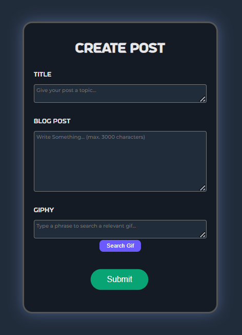
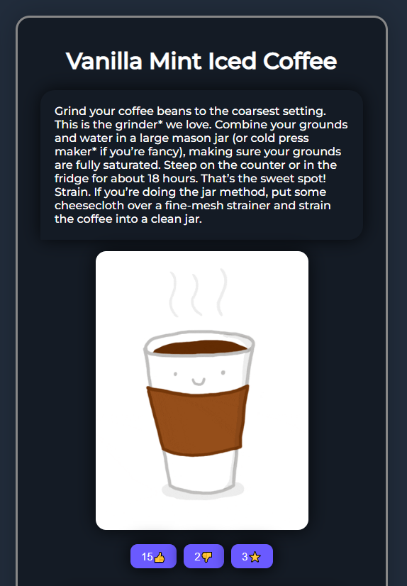

# Welcome to Connekt!

Connekt is the anonymous blogging site to talk about whatever you want! 
Have a crazy story or a funny joke to tell?
Or maybe you want to share a controversial opinion...like Harry Maguire is the best football player in the world?
Then Connekt is the right platform for you! Tell others whatever you want, at a touch of a button.

## Table of Contents

- [Installation & Usage](#installation--usage)
  - [Installation](#installation)
  - [Local Usage](#usage)
  - [Deployment](#deployment)
- [See the Sites](#see-the-sites)
- [Technologies](#technologies)
- [Changelog](#changelog)
- [Wins & Challenges](#wins--challenges)
  - [Wins](#wins)
  - [Challenges](#challenges)
- [Bugs](#bugs)
- [Goals for the Future!](#goals-for-the-future)

## Installation & Usage

### Installation

- Clone or download the repo
- Navigate to the Lap1_Community_Page_Project folder at the command line
- Run `npm install` to install dependencies

### Local Usage

- Run `npm start` to compile the source code
- Go in to `connekt.html` and start a live server for the home page
- Navigate through the navbar for the other html pages

### Deployment

- View the client live on [Netlify](https://connektproject.netlify.app/connekt.html)

#### Testing

- While in the server folder within Lap1_Community_Page_Project, run `npm test` to launch the test suite

## See the Sites

#### Create your own blog...

#### ...or just read everybody elses!

## Technologies used

#### Planning & Design Tools

- Trello Board ([View our template here](https://trello.com/b/hhcGRN9S/connekt-lap1-project))
- Lucid Board ([View our template here](https://lucid.app/lucidchart/927ab4af-5953-46f4-b5b5-7f5142d72068/edit?beaconFlowId=0A30EA52026A7947&invitationId=inv_422ad741-c355-456f-b14f-1d2b9d957bdf&page=0_0#))

#### HTML/CSS/JS Tools

- Watchify

## Changelog

#### HTML/CSS

- init commit
- add w3c template to all html files
- add navbar to all html files
- added bootsrap for the footer for connekt.html & index.html
- add images to connekt.html
- add blog page w/ comments
- responsive wepages
- emojis added to counter
- add comments in post.html
- style each html page
- add functionality to hamburger menu

#### JavaScript

- set up fetch requests in app.js
- finish request to fetch all blogs
- add gif fetch request to POST request
- new comments print to post.html
- set up emoji updating
- emoji updates with server

## Wins & Challenges

### Wins

- Fully responsive website working on desktop
- Can select emojis avaliable on posts
- Integrating the Giphy API
- Testing at 75% coverage (client) & 82% coverage (server)
- Sleek style to our posts

### Challenges

- Reaching test coverage over 60%
- styling html pages thats consistent on all devices

## Bugs

- Emoji button doesn't allow two people to click on it at the same time
- Emoji button won't count one person's like if two people press it at the same time without refreshing the page

## Goals for the Future!

- Adding a search bar to search for specific posts
- Have a search results page
- Add timestamp to comments
- Show how many remaining characters there are in text area
- add a wide variety of emojis

---
## Minimum Viable Product

### Prework

- [x] write this README
- [x] design using Lucid
- [x] fill Trello board

### Functionality

- [x] anonymous posts
- [x] intergrate giphy api
- [x] view other people's entries
- [x] react to post with an emoji
- [x] comment on other people's posts

### Technical

- [x] 60% test coverage (minimum)
- [x] deploys on netlify 

### Technologies

- [x] express
- [x] cors
- [x] jest -DEV
- [x] supertest -DEV
- [x] nodemon -DEV
- [x] jest-fetch-mock -DEV

#### Fun extras

- [x] Favicon!

#### Contributors to README file

- Saamiya, Rameez, Ali & Harry 
